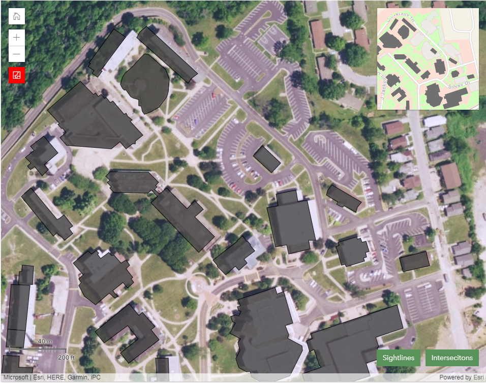
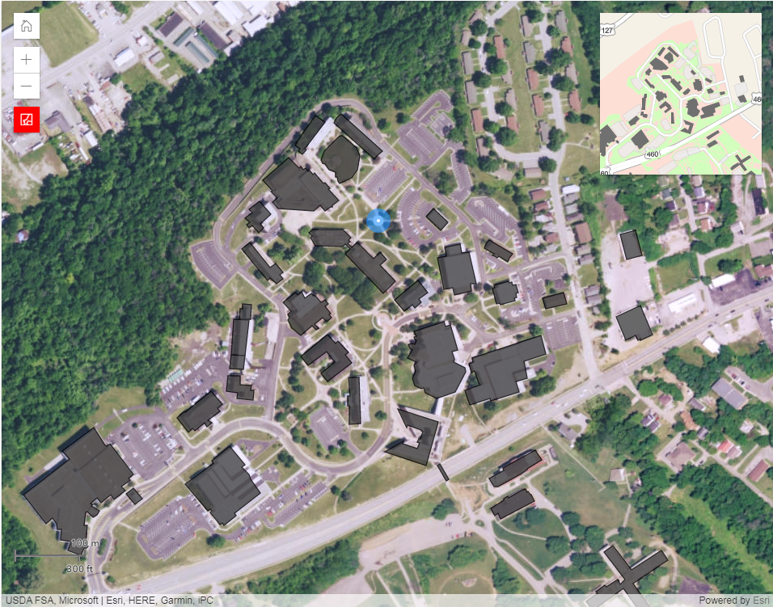
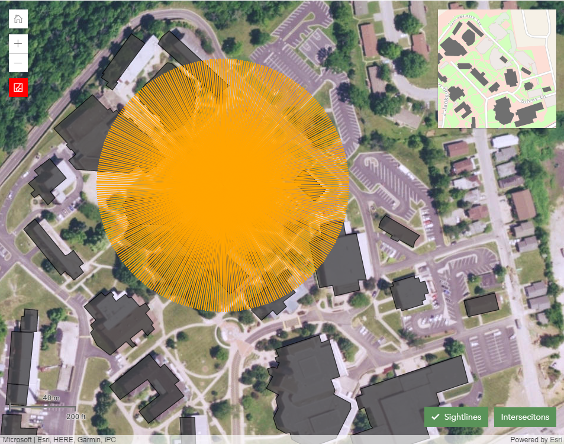
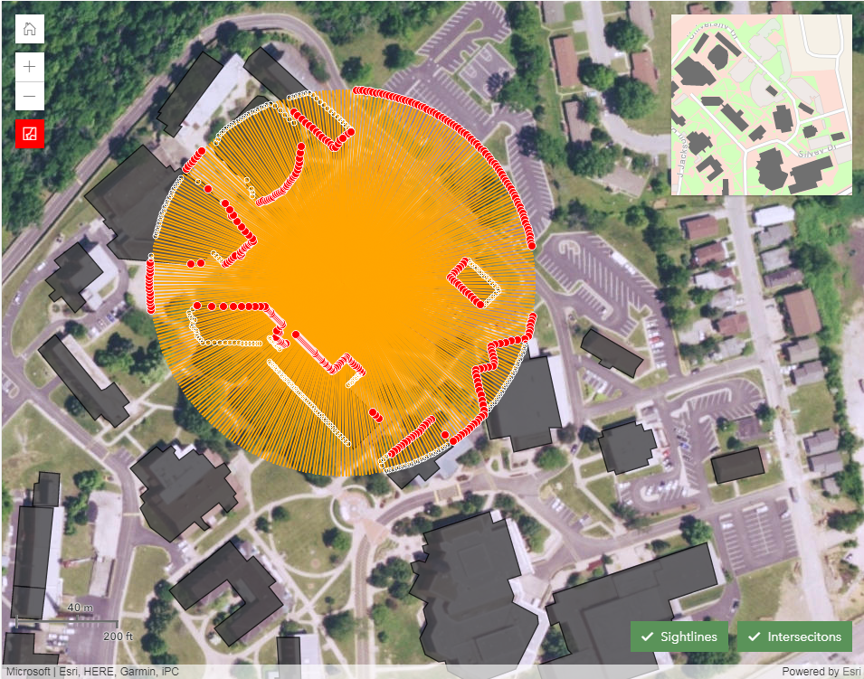
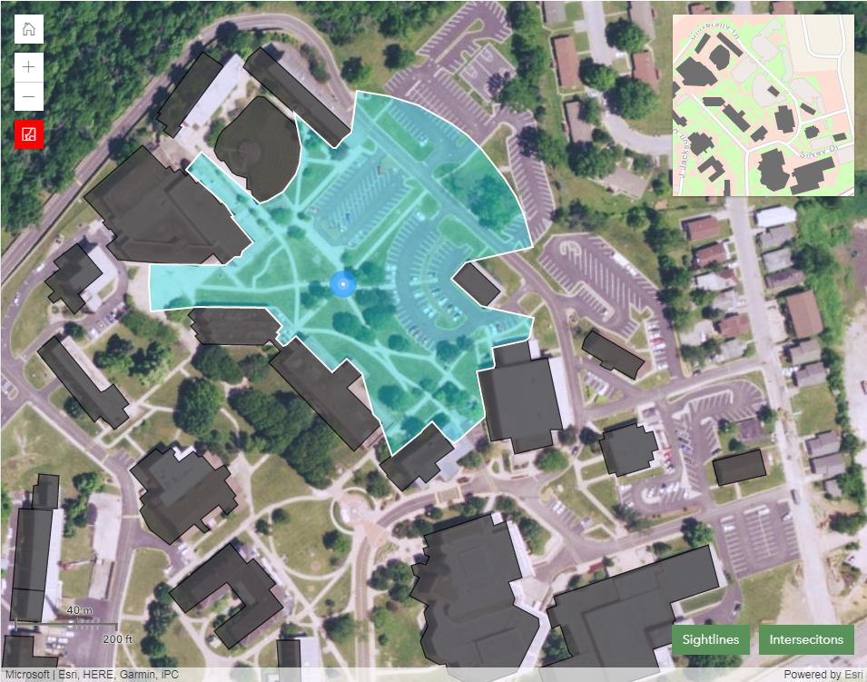
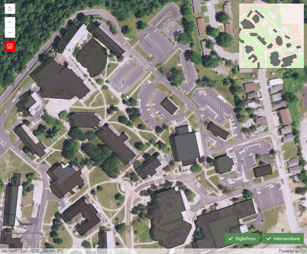

# Blue Light Visibility Analysis

Where should we position Blue Lights (emergency call boxes with blue lights) sprinkled around campus?

* How can we accommodate our visitors while doing our best to ensure their safety?
* Where do we currently have troublesome areas?
* Where should security patrols be located?

> [You can try out the demo web app here...](https://apl.esri.com/jg/BlueLights/index.html)

### Let's take a closer look at the geometry based analysis...

## Obstructions
> The analysis is performed on the selected layers that represent obstructions to visibility at a particular campus. Typically the layers will model such real world features as building and trees, but any Feature Layer with polygon data can be used. All of the obstruction features will be drawn with the same symbol, a dark gray fill with a darker outline.

## Blue Light Location
> The analysis starts by toggling the 'Add Blue Light' button and clicking/tapping on the map where you'd like to place a Blue Light. The location of the Blue Light will be displayed on the map with a blue and white symbol. While the 'Add Blue Light' button is toggled on, subsequent clicks/taps on the map will add more Blue Lights. You can also use an interactive drag action on the map to add a Blue Light, but analysis will be performed at a lower resolution until the drag action is finished.
>
> 

> NOTE: Map navigation will be disabled while the 'Add Blue Light' button is toggled on.
>
> ALSO: Each Blue Light will appear in the 'Blue Light Locations' list where you can rename or remove it. The list also allows to remove all Blue Lights and for the export of the Blue Light locations as a CSV file.

## Buffer & Sightlines
> The analysis first creates a buffer from each Blue Light location, and then creates sightlines from each Blue Light location to the edge of its buffer. In the image to the left the sightlines are displayed with an orange symbol. We use 360 locations around the edge of the buffer when performing the final analysis but only 60 locations are used in interactive drag mode. Using this buffer we then intersect it with the obstruction features to find the subset of obstruction features necessary for each Blue Light location.
>
> 

## Nearest Obstruction Intersections
> The analysis then iterates over each sightline and intersects it with the appropriate subset of obstruction features to come up with a list of obstruction intersection locations. In the image to the left they are displayed as small white circles. For each group of obstruction intersection locations (for each sightline) we then find the one that is closest to the Blue Light location. If there are no obstruction intersections along a sightline, we then use the edge of the sightline that intersects the buffer. In the image to the left these are displayed with a red symbol.
>
> 

## Visibility Area
> For each Blue Light location the analysis will create a Polygon from all of the nearest obstruction intersection locations. These visible areas are displayed with a light cyan fill. Once all visible areas are calculated, the analysis will combine them all into a single Polygon which is displayed with a white outline symbol. The total visible and overlap areas measurements are calculated and displayed above the map.
>
> 

## Blue Light Visibility Analysis
> This animation shows the concepts discussed above. If you have any questions about the analysis please send us an email.
>
> 

Enjoy!
